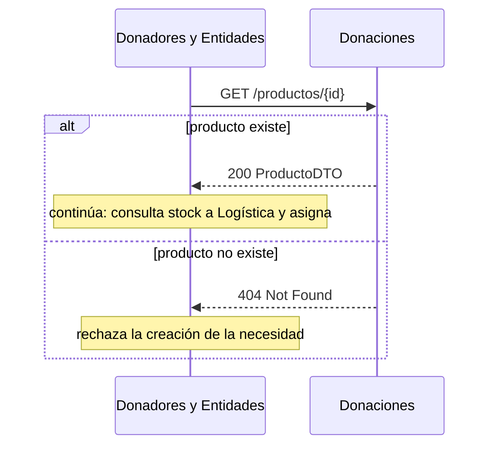
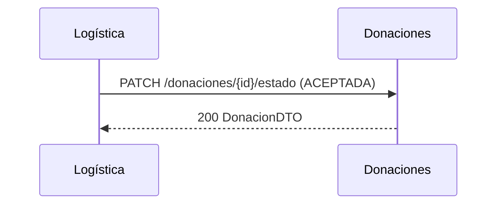

# Entrega 4 — Módulo Donaciones

Bot Telegram, integración asincrónica y nuevas funcionalidades.

Este documento describe **qué cambió en el módulo Donaciones** para la Entrega 4 y cómo
encaja en los flujos del sistema integrado. La responsabilidad de Donaciones en esta entrega
es acotada (es un servicio de soporte para las nuevas funcionalidades de los otros módulos),
por eso también se documenta el **scope cross-módulo** para coordinar con el grupo.

## 1. Cambios implementados en Donaciones

| Cambio | Detalle |
|--------|---------|
| `GlobalExceptionHandler` | `@RestControllerAdvice` que mapea `NoSuchElementException → 404`, `IllegalArgumentException → 400` y `RuntimeException → 400`. Antes cualquier error devolvía 500. |
| Validación de producto | `GET /productos/{id}` ahora devuelve **404** si el producto no existe, que es lo que "Donadores y Entidades" necesita para validar el producto de una necesidad. |
| `GET /productos` | Lista todos los productos. |
| `GET /identificadores` | Lista todos los identificadores. |
| Métricas extendidas | Nuevos contadores: `donaciones.consultas`, `productos.registrados`, `identificadores.registrados`. |
| Logs de trazabilidad | Cada endpoint y cada llamada saliente (a Donadores / Logística) se loguea en consola (Render). |

## 2. Flujos de integración que tocan Donaciones

### 2.1 Donadores y Entidades → Donaciones: validar producto de una necesidad (NUEVO en E4)

Al crear una necesidad, "Donadores y Entidades" primero valida que el producto exista en Donaciones.



### 2.2 Incentivos → Donaciones: donaciones de un donador (E4 lo usa para el cron y la pérdida de progreso)

```mermaid
sequenceDiagram
    participant CRON as Incentivos (Cron-Job)
    participant DON as Donaciones
    CRON->>DON: GET /donaciones?donadorID={id}&fecha={f}
    DON-->>CRON: 200 [DonacionDTO] (incluye productoID y estado)
    Note over CRON: cuenta donaciones ACEPTADA; si bajan de 20 por quejas, revierte misión/insignias
```

### 2.3 Logística → Donaciones: cambiar estado al reportar entrega (se mantiene de E3)



## 3. Scope cross-módulo (responsabilidad de otros integrantes)

Estas funcionalidades de la Entrega 4 **no** son del módulo Donaciones; se listan para coordinar con el grupo:

- **Logística**
  - *Parte A — Stock*: al recibir una donación, si no hay necesidades para el producto, guardar en stock; si hay, asignar lo necesario y guardar el sobrante. Capacidad por unidades.
  - *Parte B — Asíncrono*: mover la asignación a una **cola de trabajo**; uno o más **Workers stateless** consumen el mensaje, calculan la asignación y hacen `POST` a Logística para darla de alta. Mensajería desplegada en la nube.
- **Donadores y Entidades**
  - Al crear una necesidad: validar el producto contra **Donaciones** (flujo 2.1) y consultar stock a **Logística**; asignar al momento lo disponible/necesario. Diferenciar si la asignación vino del matchmaking o de esta solicitud.
- **Incentivos**
  - **Cron-Job** periódico que procesa donadores con misiones asignadas.
  - **Pérdida de progreso**: si un donador con la misión "Donaciones Exitosas" (20 ACEPTADA) recibe quejas y baja de 20, pierde el progreso, retrocede de categoría y se le quitan las insignias.
- **Bot de Telegram (UI)** — orientado a Donadores/Entidades
  - Donador: registrarse, consultar estadísticas, consultar donadores (por ID y todos).
  - Admin: CRUD de entidades y necesidades. Por ahora corre localmente, un solo proceso a la vez.

## 4. Decisiones de diseño

- Se trabajó en una rama aislada (`entrega-4`) para no afectar el despliegue de la Entrega 3 en `main`/Render mientras se prueba.
- No se modificó nada de `catedra/` ni `.github/` (archivos protegidos). La suite de cátedra sigue en verde.
- El `GlobalExceptionHandler` solo cambia los códigos HTTP de salida; no altera las excepciones que lanza la Fachada, por lo que los tests de cátedra (que llaman a la Fachada directamente) no se ven afectados.
